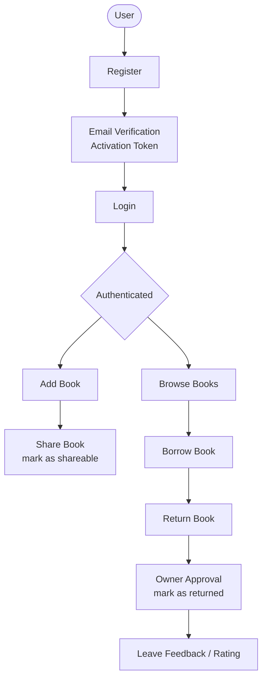
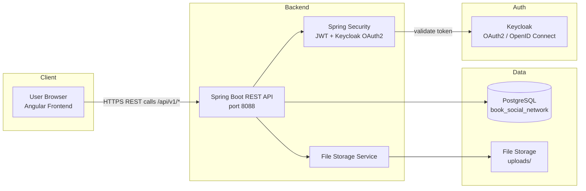
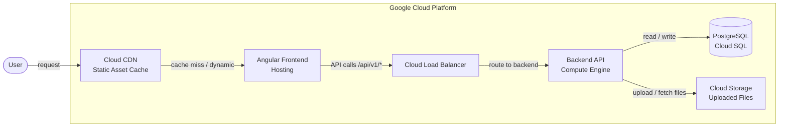

# Angular Learning Project

A full-stack learning project built to explore Angular frontend development, Spring Boot backend APIs, and deployment on Google Cloud Platform. The application implements a Book Social Network where users can register, share books, borrow and return books, and leave feedback.

---

## Tech Stack

### Frontend
| Technology | Purpose |
|------------|---------|
| Angular | SPA framework |
| TypeScript | Typed JavaScript |
| Bootstrap | UI styling |

### Backend
| Technology | Purpose |
|------------|---------|
| Spring Boot 3 | REST API framework |
| Spring Security 6 | Authentication & authorization |
| Keycloak (OAuth2 / OpenID Connect) | Identity provider |
| JWT Authentication | Stateless token-based auth |
| REST APIs | Client–server communication |

### Database
| Technology | Purpose |
|------------|---------|
| PostgreSQL | Relational database |

### Infrastructure
| Technology | Purpose |
|------------|---------|
| Docker | Containerization (local & production) |
| Google Cloud Platform | Cloud hosting |
| → Compute Engine | Backend VM instances |
| → Cloud Storage | Uploaded file storage (book covers, avatars) |
| → Cloud CDN | Static asset caching |
| → Cloud Load Balancer | Traffic distribution |

---

## User Flow



---

## System Architecture



---

## Google Cloud Deployment Architecture



---

## Repository Structure

```
Angularlearning/
├── book-network/          # Spring Boot backend — REST APIs, security, database models
│   ├── src/
│   │   ├── main/java/com/alibou/book/
│   │   │   ├── auth/      # Registration, login, JWT token handling
│   │   │   ├── book/      # Book entity, CRUD operations, borrowing logic
│   │   │   ├── feedback/  # Book reviews and ratings
│   │   │   ├── file/      # File upload and storage service
│   │   │   ├── security/  # JWT filter, Keycloak config, SecurityConfig
│   │   │   └── user/      # User entity, roles, activation tokens
│   │   └── resources/
│   │       ├── application.yml
│   │       └── application-dev.yml
│   └── pom.xml
├── book-network-ui/       # Angular frontend — SPA, components, services (planned)
├── keycloak/              # Keycloak realm configuration for local dev
│   └── realm/
├── uploads/               # Local file storage for user-uploaded content
├── docker-compose.yml     # Local dev stack: PostgreSQL, MailDev, Keycloak
└── README.md
```

> **`book-network/`** — Spring Boot 3 backend exposing REST APIs under `/api/v1/`. Handles authentication (JWT + Keycloak), book management, feedback, and file uploads.
>
> **`book-network-ui/`** — Angular frontend (planned/in progress). Consumes the backend REST APIs to provide the user-facing SPA.

---

## Local Development Setup

### Prerequisites
- Java 17+
- Maven 3.x
- Docker & Docker Compose

### 1. Start infrastructure services

```bash
docker-compose up -d
```

This starts:
- **PostgreSQL** on `localhost:5432` (DB: `book_social_network`)
- **MailDev** SMTP on `localhost:1025` (web UI: `http://localhost:1080`)
- **Keycloak** on `http://localhost:9090`

### 2. Run the backend

```bash
cd book-network
./mvnw spring-boot:run -Dspring-boot.run.profiles=dev
```

Backend starts on `http://localhost:8088`

Swagger UI: `http://localhost:8088/swagger-ui/index.html`
